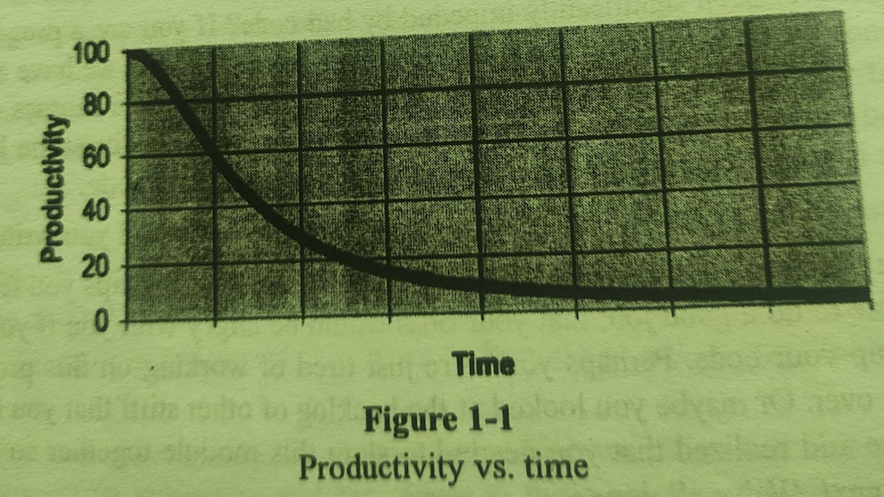

# Chapter 1 - Clean Code

## Bad Code

- Too many WTF
- Tightly coupled
- In order to contribute have to read each function line by line
- is not open for extension
- have to modify current code in order to contribute
- fragile
- no test written

## The Total Cost of Owning a Mess

## The Grand Redesign

- Race between Tigers and zebra

## Attitude

- why code rot (requirements changed too frequent, too tight schedule, stupid managers, intolerant customers, useless marketing materials)
- In reality it was in ourselves, We are unprofessional.
- This is their job to meet the deadline, push too much things in short time.
- Solution: Don't do what managers says blindly. Most managers want the truth, even when they don't act like it. Most Managers want good code, even they are obsessed with schedule.
- What if a patient demand for operation without silly hand-washing. It would be unprofessional for the doc to comply with the patient.

- You will not make the deadline by making the mess. Indeed, the mess will slow you down instantly and force you to miss the deadline.

## What is clean code

- The art of Clean Code. detecting does not mean you can implement.
- Elegant, Readibility
- Simple & Direct
- Crisp Abstraction
- Avoid nesting & tangling like spagetti
- Predictable
- Reader says, "Aha! of Course!"
- Extentale
- Composable
- Code will say "Coder cares of this code"
- No Duplication, Runs all tests
- looks like language is made for the problem

## The Boy Scout Rule

- Leave the code cleaner than you found it.
- codebase will get better and better over time.
- Don't over do refactoring.
- Don't implement feature when you are refactoring
