# Chapter 3 - Functions

### Listing 3-1 | HtmlUtil.java

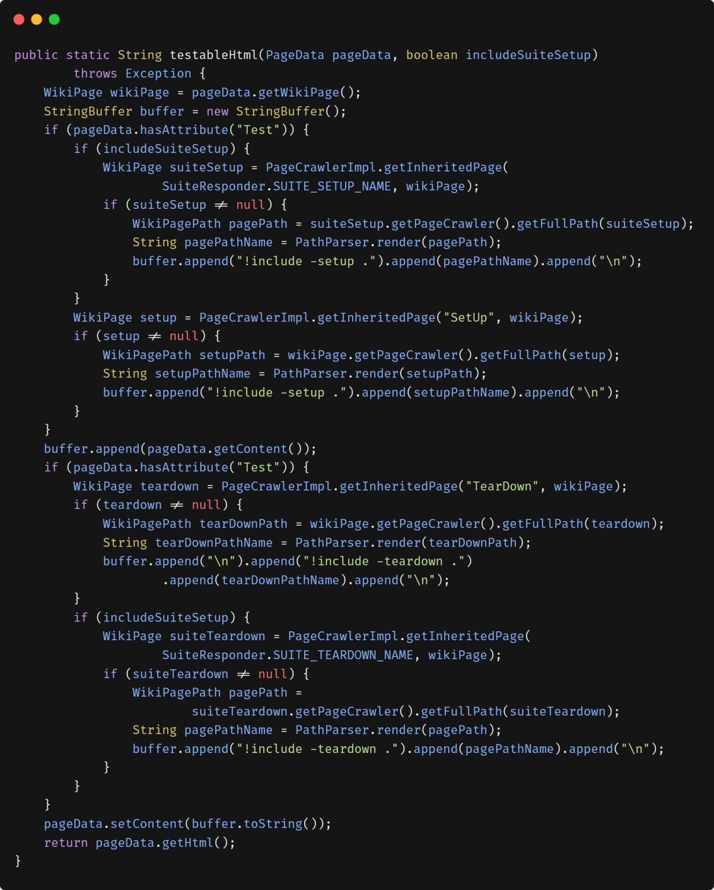

## Small

- Should be at maximum 20 lines long.

- The blocks within if, else, while, and so on should be one line long. Probably that line should be a function call.

- The nested structures (blocks) should be one or two at maximum.

Good

### Listing 3-2 | HtmlUtil.java (refactored)

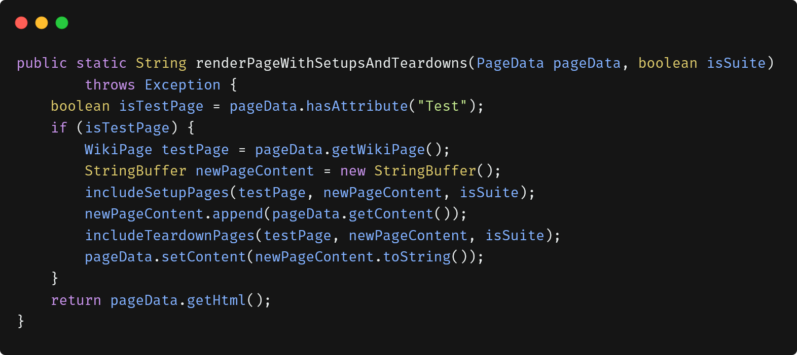

Better

### Listing 3-3 | HtmlUtil.java (re-refactored)

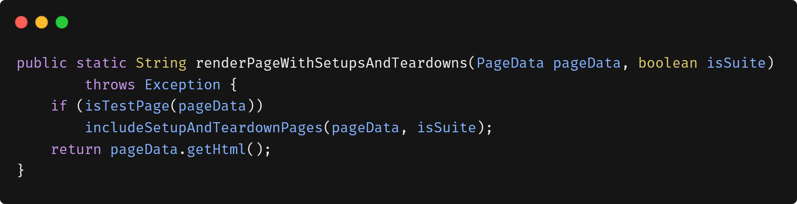

## Do One Thing:

- Functions should do ONE thing. They should do it WELL. They should do it ONLY.

To know the function do one thing or not, try to describe it as an only one TO paragraph:

```
"RenderPageWithSetupsAndTeardowns", we check to see whether the page is a test page and if so, we include the setups and teardowns. In either case we render the page in HTML.
```

- Look above at Listing 3-1 is doing more than one thing. It’s creating buffers, fetching pages, searching for inherited pages, rendering paths, and so on.. It contains many different levels of abstraction (many TO paragraphs).

- Even Listing 3-2 has two levels of abstraction (two TO paragraphs).

- Functions that do one thing cannot be reasonably divided into sections.

## One Level of Abstraction per Function:

- The Stepdown Rule (Reading Code from Top to Bottom): <br>
  Make your code reads like a top-down story (top-down set of TO paragraphs). To do that, should every function written in a single level of abstraction and followed by the next function in the next level of abstraction, and the third one in the third level of abstraction.

- top level
  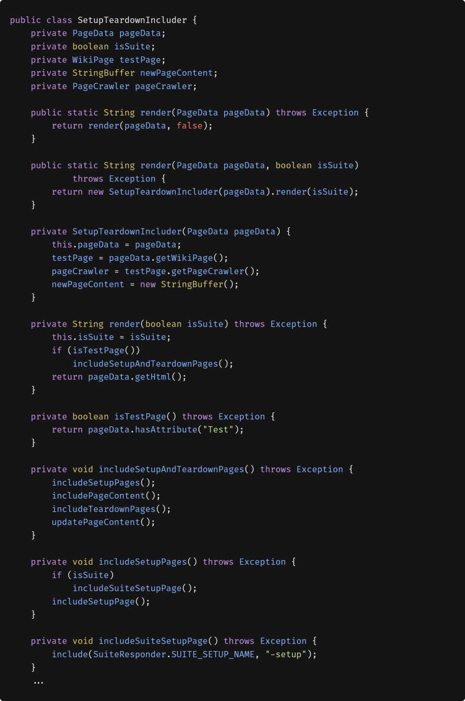

- mid level
  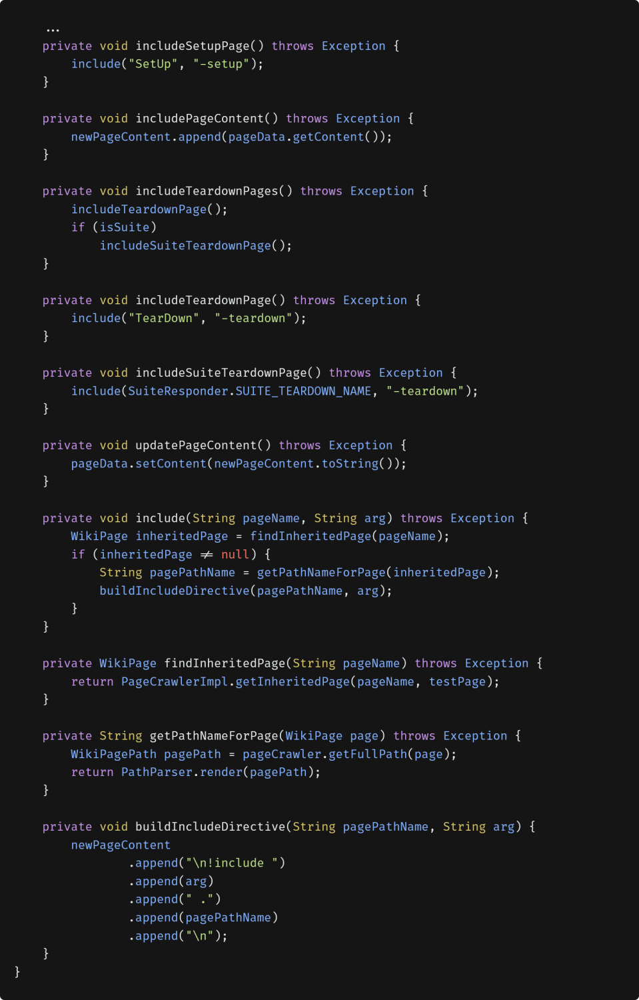

## Switch Statements:

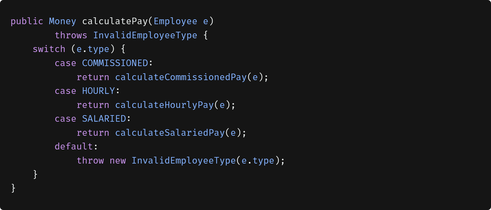

### problems

- its large, when new employee type added it grows
- does more than one thing
- violates SRP (more than one reason to change)
- it violates OCP (must change on new type added)
- lots of other function has to repead this code

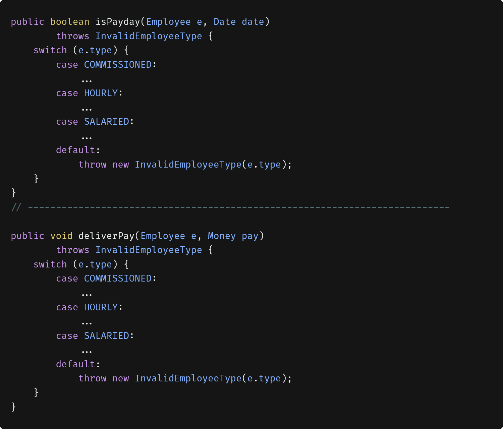

### solution

The solution (See the following nippet) to this problem is to insert the switch statement in the ABSTRACT FACTORY, and never let anyone see it. The factory will use the switch statement to create appropriate instances of the derivatives of Employee, and the various functions, such as calculatePay, isPayday, and deliverPay, will be dispatched polymorphically through the Employee interface.

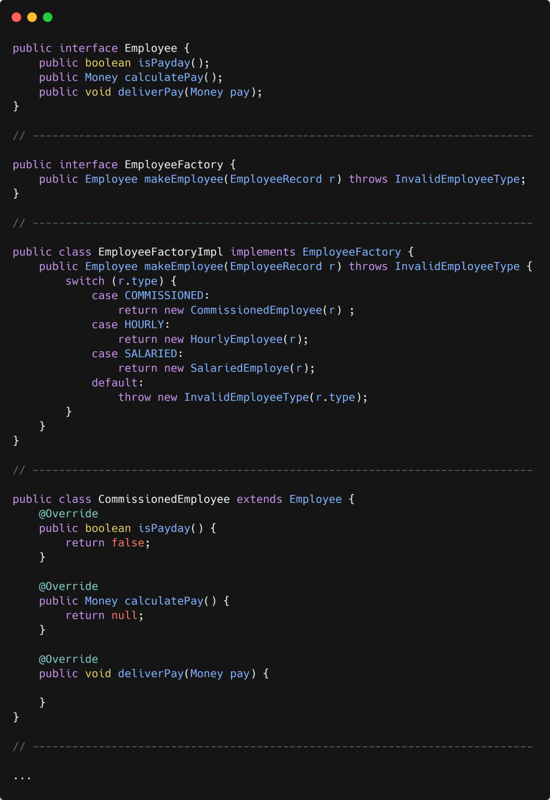

So, by using the new design we can make sure that the switch statement is inserted in a class and never repeated again in your code.

## Use Descriptive Names

Don’t be afraid to make a name long. A long descriptive name is better than a short unclear name. A long descriptive name is better than a long descriptive comment.

Don’t be afraid to spend time choosing a name.

Choosing descriptive names will clarify the design of the module in your mind and help you to improve it.

## Function Arguments:

- The ideal number of arguments for a function is zero.
- Three arguments should be avoided as possible.
- More than three requires a special justification.. and shouldn’t be used anyway.

## Common Monadic Forms (one argument function):

There are three reasons (three forms) to pass a single argument into a function.

1. Function that asking a question about that argument. Ex: `boolean fileExists(“MyFile”).`
2. Function that transforming the argument into something else and returning it. Ex
   `InputStream fileOpen(“MyFile”)`
   transforms a file name String into an InputStream return value.
3. Function is an event: in this form there is an input argument but no output argument, and the function use the argument to alter the state of the system Ex
   `void passwordAttemptFailedNtimes(int attempts)`

Try to avoid any monadic functions that don’t follow these forms, for example, void includeSetupPageInto(StringBuffer pageText). Using an output argument instead of a return value for a transformation is confusing. If a function is going to transform its input argument, the transformation should appear as the return value.

## Flag Arguments (Boolean arguments):

Flag arguments are ugly. It complicates the signature of the function. It makes the function does more than one thing, one thing if the flag is true and another if the flag is false. They are confusing and should be eliminated if possible.

<b>Ex:</b> Let's imagine we want to make a booking for a Hotel. There are two ways to do this, regular and premium. To use a flag argument here we would make a function declaration like this:


Then, when you (or anyone who read your code) see this function call `book(customer, true)`, you can't remember what is the function do and what is the boolean argument means without going to read its implementation, but it's better if we separate it to two

```javascript
function regularBook(customer)
function premiumBook(customer)
```

so, now it's easy to know what is the function do exactly from his call without need to go to its implementation.

## Dyadic Functions (two arguments function):

A function with two arguments is harder to understand than a monadic function. But of course, there are times where two arguments are appropriate like <b>Point p = new Point(0, 0);</b> This is for sure because the points naturally take two arguments.

It will be better if you find a mechanism to convert the dyadic function to monadic (in some cases if possible). For example

```javascript
writeField(outputStream, name);
```

can convert to monadic by any one of these methods:

1. Make the writeField a member function of OutputStream class so that you can say

```javascript
outputStream.writeField(name);
```

2. Or make the outputStream a member variable of the current class so that you don’t have to pass it, like this

```javascript
writeField(name);
```

## Triads Functions (three arguments function):

Function that takes three arguments is significantly harder to understand than dyadic. You should think very carefully before creating a triad.

## Argument Objects:

When a function seems to need more than two or three arguments, then, it is likely that some of those arguments should be wrapped into a class of their own. For example,

```javascript
function makeCircle(x, y, radius);
```

```javascript
function makeCircle(center, radius);
```

## have No Side Effects:

Side effects mean that your function promises to do one thing, but it also does other hidden things. So, try to avoid these things because they leads to a temporal couplings and fixed order of execution

For example, the bellow function uses an algorithm to match a **userName** to a **password**. It returns **true** if they match. and **false** if anything goes wrong.

But, it also has a side effect is the call to **Session.initialize()**. The checkPassword function, by its name, says that it checks the password, but, the name don't says that it initializes the session.

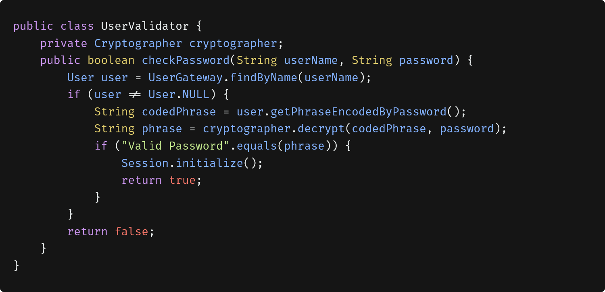

### Output Arguments

Arguments are often interpreted as inputs to a function, but sometimes interpreted as an outputs. For example, **appendFooter(s);** it's not obvious if that call takes **'s'** as an input and appends it to footer, or takes **'s'** as an output and appends footer to it. So, you have to go to the declaration to clarify the issue,

```javascript
function appendFooter(report)
```

This clarifies the issue (you know now that **'s'** is an output), but only at the expense of checking the declaration of the function (this called **double-take**).

Output arguments should be avoided. If your function must change the state of something, have it change the state of its owning object. Like that **report.appendFooter();**

## Command Query Separation:

Functions should either do something or answer something, but not both. For example:

```javascript
function set(attribute, value);
```

This function sets the value of a named attribute and returns **true** if it is successful and **false** if no such attribute exists. This leads to odd statements like this:

```javascript
if(set("username", "unclebob"))
```

This function confused the reader? Is it asking whether the **“username”** attribute was previously set to **“unclebob”**? Or is it asking whether the **“username”** attribute was successfully set to **“unclebob”**?

The solution is to separate the command from the query so that the ambiguity cannot occur.

```javascript
if (attributeExists("username")) {
  setAttribute("username", "unclebob");
  ...
}
```

## Prefer Exceptions over Returning Error Codes:

When you return an error code, that leads to two problems,

- Deeply nested structures.
- The caller must deal with the error immediately.

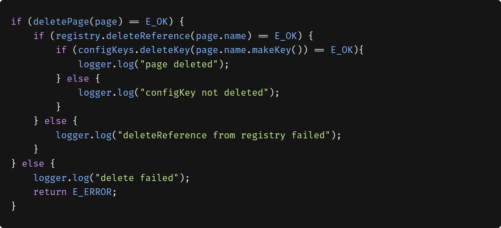

**Solution:** if you use exceptions instead of returned error codes, then the error processing code can be separated from the happy path code. This make it more simple.

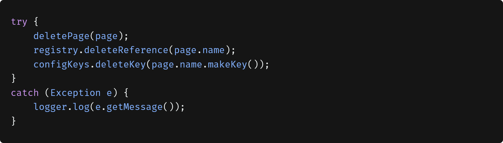

### Extract Try/Catch Blocks:

**Try/catch** blocks are ugly and confuse the structure of the code and mix error processing with normal processing (happy path). So it is better to extract the bodies of the **try** and **catch** blocks out into functions of their own, like this:

```javascript
import {logError} from 'logger';

function delete(page) {
  try {
    deletePageAndAllReferences(page);
  } catch (error) {
    logError(error)
  }
}

function deletePageAndAllReferences (page) {
  deletePage(page);
  registry.deleteReference(page.name);
  configKeys.deleteKeys(page.name.makeKey());
}
```

### Error Handling Is One Thing:

Functions should do one thing. Error handing is one thing. So, a function that handles errors shouldn't do another thing.
If the keyword **try** exists in a function, it should be the first word in the function and should be nothing after the **catch/finally** blocks.
Ex) The **function delete(Page page)** in the previous section.

### DRY:

Look up at Listing 3-1 carefully and you will notice that there is an algorithm that gets repeated four times,

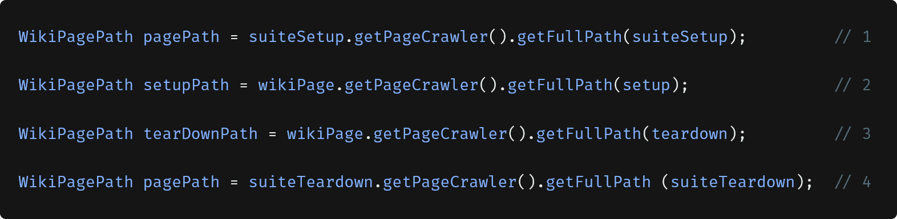

This duplication was reduced by the include method


## Structure Programming:

**Edsger Dijkstra’s** rules of structured programming say that every function, and every block within a function, should have **one entry** and **one exit**. Following these rules means that there should only be **one return** statement in a function, no **break** or **continue** statements in a loop, and never, ever, any **goto** statements.

<div style="font-size: 20px; border-left: 4px solid gray; padding-left: 10px;">
Master programmers think of systems as stories to be told rather than programs to be written.
</div>

## Reference

- https://www.linkedin.com/pulse/clean-code-summary-chapter3-functions-mahmoud-ibrahim/
