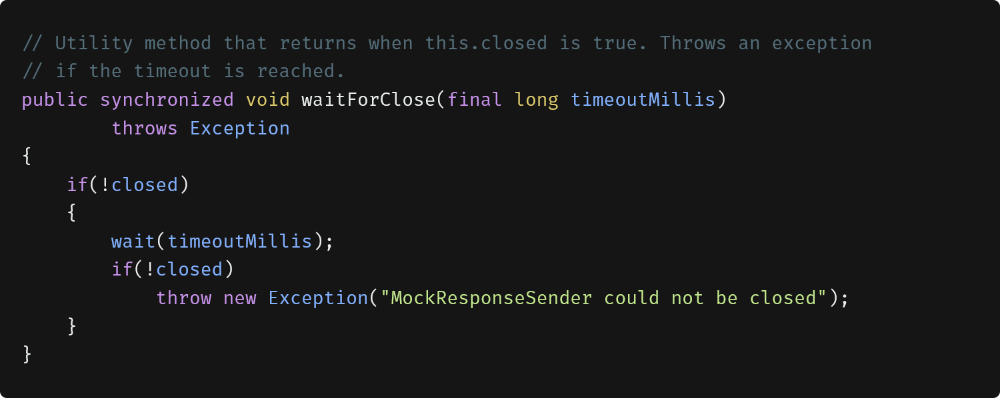
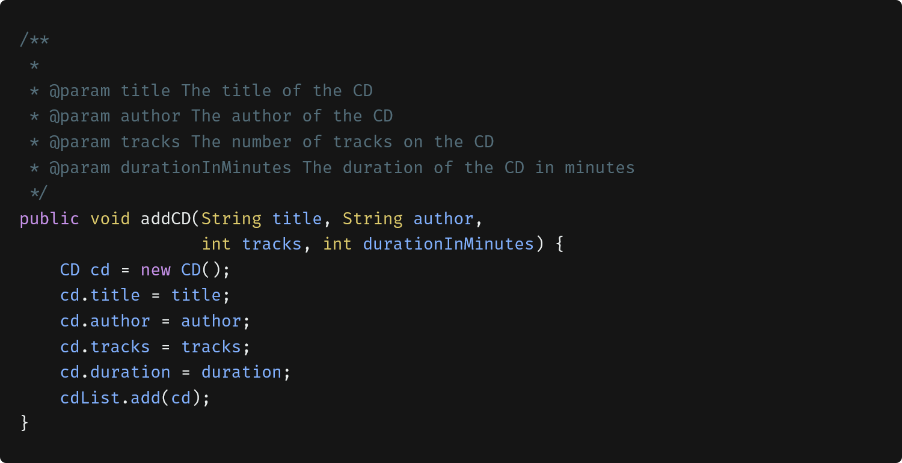
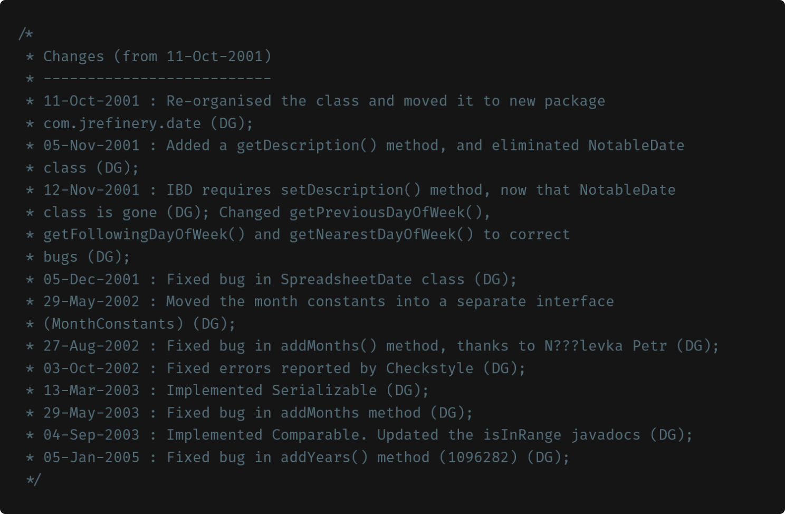
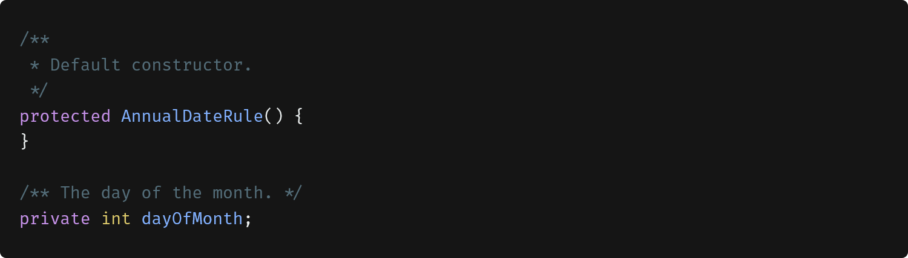
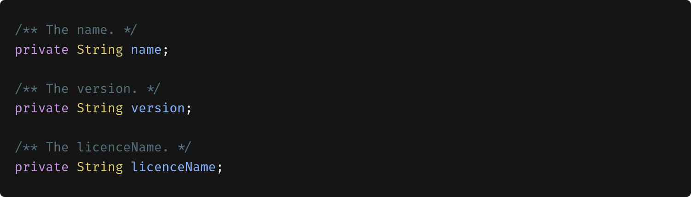
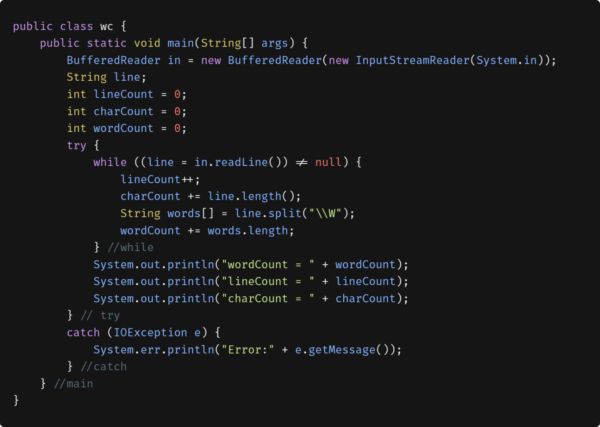
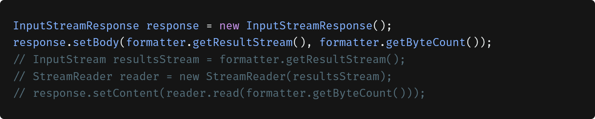
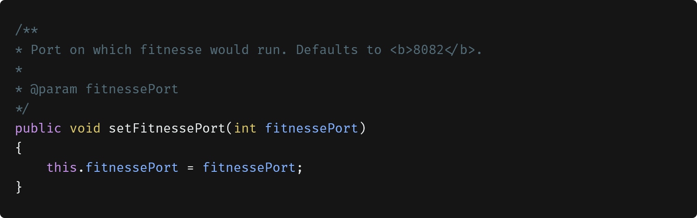
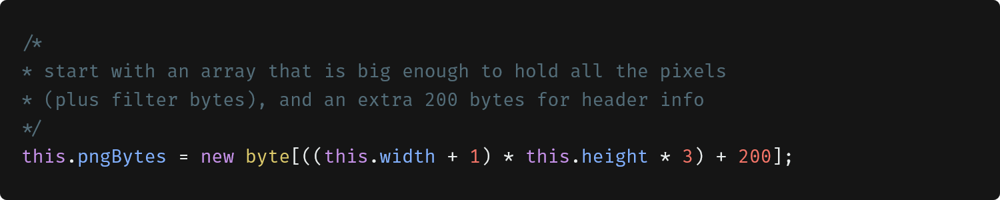

# Comments

## Don't comment bad code- rewrite it.

Nothing can clutter up a module more than frivolous dogmatic comments. Nothing can be quite so damaging as an old crufty comment that propagates lies and misinformation. Comments are at best a necessary evil. if we can express our intent, we would not need comments very much--perhaps not at all.

The proper us of comments is to compensate for our failure to express ourself in code. Comments are always failures. So when you find yourself in a position where you need to write a comment, think it though and see whether there isn't some way to express yourself in code. Every time you express yourself in code, you should pat yourself on the back. Every time you write a comment, you should feel the failure of your ability of expression.

Why comments are bad? Because they lie. Not always, and not intentionally but too often. The older a comment is, and the farther away it is from the code it describes, the more likely it is to be just plain wrong. The reason is simple.Programmers can't realistically maintain them.

Code changes and evolves. Chunks of it move from here to there. Unfortunately the comments don't always follow them--can't always follow them. And all too often the comments get separated from the code they describe.

Inaccurate comments are far worse than no comments at all. They delude and mislead. They set expectations that will never be fulfilled. They lay down old rules that ned not, or should not, be followed any longer.

Truth can only be found in one place: the code. Only the code can truly tell you what it does. It is the only source of truly accurate information.

## Comments Do Not Make Up for Bad Code

One of the more common motivations for writting comments is bad code. We write a module and we know it is confusing and disorganized. We know it's a mess. So we say to ourselves, "Ooh, I'd better comment that!" <b>No! you'd better clean it!</b>

Clear and expressive code with few comments is far superior to clutter and complex code with lots of comments. Rather than spend your time writting the comments that explain the mess you've made, spend it cleaning that mess.

## Explain Yourself in Code

which one is better?

```javascript
if((employee.flags & HOURLY_FLAG) && (employee.age > 65))
```

OR

```javascript
if (employee.isEligibeForFullBenefits())
```

It takes only a few seconds of thought to explain most of your intent in code. In many cases it's simply a matter of creating a function that says the same thing as the comment you want to write.

## Good Comments

### Informative comments

```javascript
const emailPattern = /^[a-zA-Z0-9_.+-]+@[a-zA-Z0-9-]+\.[a-zA-Z0-9-.]+$/;
// valid: 'example123@gmail.com';
// invalid: 'invalidemail@'
```

```javascript
const currentDate = new Date();
const options = {
  weekday: "long",
  year: "numeric",
  month: "long",
  day: "numeric",
  hour: "numeric",
  minute: "numeric",
  second: "numeric",
  timeZone: "UTC",
};
const formattedDateTime = currentDate.toLocaleString("en-US", options);
// Saturday, January 1, 2022, 10:30:45
```

### TODO Comments

It is sometimes reasonable to leave "To do" notes in the form of //TODO comments.

```javascript
//TODO- these are not needed
// We expect this to go away when we do the checkout model

function makeVersion() {
  return null;
}
```

TODOs are jobs that the programmer thinks should be done, but for some reason can't do at the moment. It might be a reminder to delete a deprecated feature or a plea for someone else to look at a problem. Whatever else a TODO might be, it is not an excuse to leave bad code in the system.

## Bad Comments

Most comments fall into this category. Usually they are crutches or excuses for poor code or justifications for insufficient decisions.

### Mumbling

Plopping in a comment just because you feel you should or because the process requires it, is a hack. if you decide to write a comment, then spend the time necessary to make sure it is the best comment you can write.

### Redundant Comments

In the following function there is a header comment that is completely redundant. The comment probably takes longer to read than the code itself. Also it's not more informative than the code.


### Mandated Comments

For example, required javadocs for every function lead to ugly code and add nothing to the code, such as:


### Journal Comments

Sometimes people add a comment to the start of a module every time they edit it. But, currently, we have a source code control systems (ex. Git) that did it for us. So, we no longer need the journal comment.



### Noise Comments

Sometimes you see comments that are nothing but noise. They provide no new information.





### Position Markers


### Closing Brace Comments



### Attributions and Bylines


### Commented-Out Code

Others who see that commented-out code won’t have the courage to delete it. They’ll think it is there for a reason.



We’ve had good source code control systems for a very long time now. Those systems will remember the code for us. We don’t have to comment it out anymore. Just delete the code. We won’t lose it. Promise.

### Nonlocal Information

If you must write a comment, then make sure it describes the code it appears near, not far thing. For example, the following comment offers information about the default port (8082), this is not describing the function, but some other, far distant part of the system. There is no guarantee that this comment will be changed when the code containing the default is changed.



### Inobvious Connection

The purpose of a comment is to explain code that does not explain itself. It is inappropriate when a comment needs its own explanation, like the following:



All these questions in-obvious: What is a filter byte? Does it relate to the +1? Or to the \*3? Both? Is a pixel a byte? Why 200?

### Function Headers

Short functions don’t need much description. A well-chosen name for a small function that does one thing, is usually better than a comment header.
